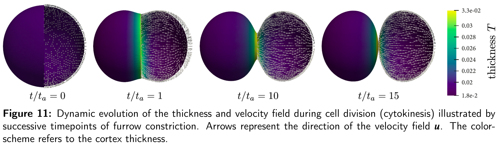
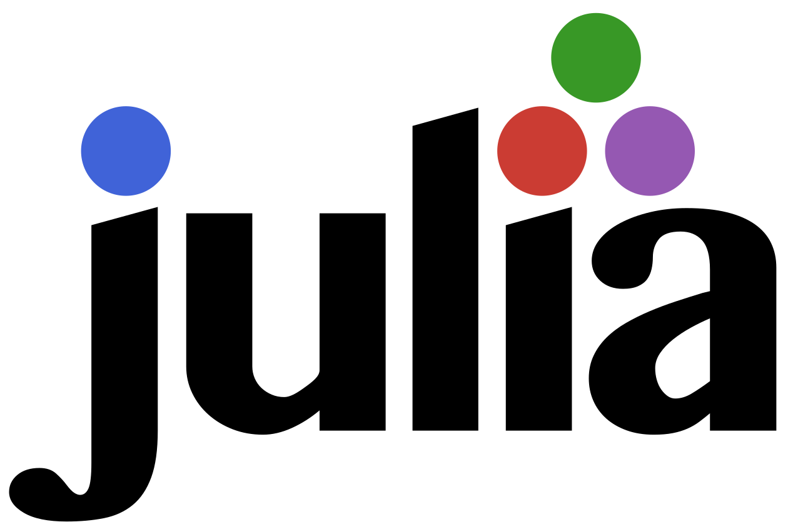
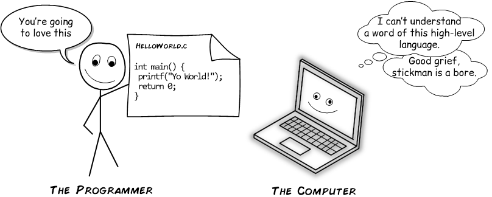
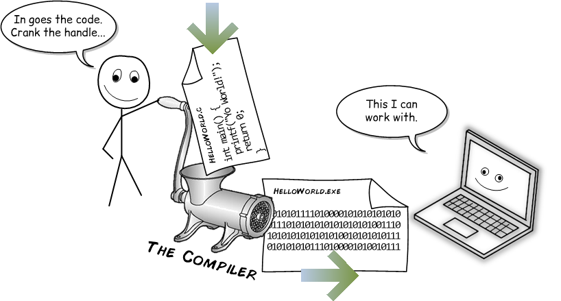
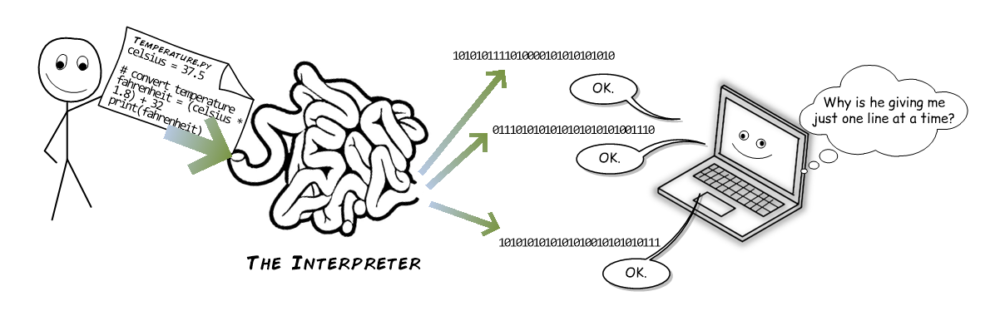

A short course in

# Finite element analysis with Gridap

## Part I: Introduction to Julia

Eric Neiva | TurlierLab group meeting | 17-02-2022

<br />

 &nbsp; 

<!--
  - Three sessions turned into a casual course
  - Help you follow my research
  - Help you interact with other FE simulation experts
-->

---

# Contents

- Motivation
- Course overview
- The Julia programming language
- Getting started with Julia

<!--
  - Give a lot of information
  - But also interactive for a lighter experience
  - Not looking into details
  - Providing a curated selection of info and links to help you migrate to Julia if the situation arises
-->

---

# Motivation

- An *abstract* FE framework for cell morphogenesis
  - To accommodate all the FE simulation needs in the lab
  - Easily import or prototype new FE technology
  - In Julia, as a subpackage of Gridap


*Borja da Rocha, Bleyer et Turlier, submitted*

<!--
  - The key point is the last one:
    - Abstract = Targeting general fluid deformable surface and coupled surface-bulk problems
    - An easily extensible framework to import and develop new technology
  - Motivate with Hudson's example
    - Admiration for the example
    - Fenics forced to compromises to implement the model with thin shell FEs
      - Mixed Interpolation of Tensorial Component (MITC) discretisation
      - Partial Selective Reduced Integration (PSRI) method
    - Difficult to extend the functionality of the code for reasons that we will shortly make clear
-->

---

# Motivation

- An *abstract* FE framework for cell morphogenesis
  - To accommodate all the FE simulation needs in the lab
  - **Easily import or prototype new FE technology**
  - In Julia, as a subpackage of Gridap


*Borja da Rocha, Bleyer et Turlier, submitted*

<!--
  - The key point is the last one:
    - Abstract = Targeting general fluid deformable surface and coupled surface-bulk problems
    - An easily extensible framework to import and develop new technology
  - Motivate with Hudson's example
    - Admiration for the example
    - Fenics forced to compromises to implement the model with thin shell FEs
      - Mixed Interpolation of Tensorial Component (MITC) discretisation
      - Partial Selective Reduced Integration (PSRI) method
    - Difficult to extend the functionality of the code for reasons that we will shortly make clear
-->

---

# Course overview

| Part | Title | Date |
| ---- | ----- | ---- |
| I    | Introduction to Julia | today |
| II   | Introduction to finite elements | *agree* |
| III  | FEA for fluid deformable surfaces | May 12 |

- Session II: Friday morning in Mar 4, 11, 18 or 25?

<!--
  - Friday morning in March: 4, 11, 18, 25?
  - Session III: STATE-OF-THE-ART
    - What kind of equations we solve?
    - Difficulties we encounter.
    - Approaches...
-->

---

# <!-- fit --> The Julia programming language



- Since 2012
- General purpose
- Focus in high-performance
- Well-suited for numerical analysis and computational science
- v1.7.2 (Feb 8 2022)
- v1.8 (very soon)

https://julialang.org/

---

# Why Julia?

<!--
  - What sets Julia apart from other languages?
-->

---

# Why Julia?

To answer this, we need to review
*high-level compiled and interpreted programming languages*

<!--
  - Not explaining this as an expert
-->

---

# <!-- fit --> High-level programming languages (almost all)


*[medium.com, Young Coder, The Difference Between Compiled and Interpreted Languages, Sep 14, 2020](https://medium.com/young-coder/the-difference-between-compiled-and-interpreted-languages-d54f66aa71f0)*

<!--
  - You need a translation step that converts your high-level code into lower-level machine-readable code
-->

---

# <!-- fit --> Compiled languages (C, C++, Java, ...) 👈 Performance


*[medium.com, Young Coder, The Difference Between Compiled and Interpreted Languages, Sep 14, 2020](https://medium.com/young-coder/the-difference-between-compiled-and-interpreted-languages-d54f66aa71f0)*

<!--
  - In a compiled language, compilation translates your source code into machine instructions.
  - Generates optimized machine code.
-->

---

# <!-- fit --> Interpreted languages (Python, JavaScript, ...) 👈 Productivity


*[medium.com, Young Coder, The Difference Between Compiled and Interpreted Languages, Sep 14, 2020](https://medium.com/young-coder/the-difference-between-compiled-and-interpreted-languages-d54f66aa71f0)*

<!--
  - The interpreter looks at your code (line by line, in the simplest case) and makes it happen. Interpreters work on smaller sections as you run your program.
-->

---

# <!-- fit --> Trade-off performance and productivity

For computationally-demanding applications (e.g., FEs):
- Hybrid software applications, e.g., fenics: 
  - ``python`` front-end + ``c++`` back-end
  - *two-language problem* > limited extensibility and prototyping
- Julia *potentially* provides better balance
  - performance and productivity _in a single environment_
<!--
  - Do you know the principal culprit for computationally-intensive FEs?
  - User front-end and computational back-end
  - Two-language problem is not a widespread term
  - Limited extensibility example (C1-continuous Loop subdivision FEs in fenics). 
  - Prototyping new FE technologies is even harder 
  - Julia is 
    - as expressive and easy to work with as python, 
    - but can achieve performance comparable to C
-->

---

# Main features of Julia

- Optional typing
- Multiple dispatch (generalisation of polymorphism)
```julia
    foo(bar) = ...
    foo(bar::Integer) = ...
    foo(bar::Float64) = ...
    foo(bar::MyType1,baz::MyType2) = ...
```
- Multi-paradigm
  - Procedural, functional, meta, object-oriented...

<!--
  - "Integer" is pronounced "Intejar"
  - Return later to multiple dispatch
  - Some OO features (polymorphism, some elementary form of inheritance), but Julia is definitely not OO like C++.
  - Not expert opinion, looks like a hotchpotch
-->

---

# Main features of Julia

- Performance through
  - type inference (deduce output types from input types)
    - generate fast, optimized code
  - just-in-time (JIT) or *run-time* compilation
    - user experience as an intepreted one
- The only non-compiled language in the petaflop $\footnotesize{\left(\mathsf{10^{15}}\right)}$ club
  - Since 2017; along with C, C++ and Fortran

<!--
- Type inference: Refers to the process of deducing the types of later values from the types of input values.
- Just-In-Time Compilation: The process of generating native-machine code into memory right when it is needed.
-->

---

# Main features of Julia

- Performance through
  - type inference (deduce output types from input types)
    - generate fast, optimized code
  - just-in-time (JIT) or *run-time* compilation
    - user experience as an intepreted one
- **The only non-compiled language in the petaflop $\footnotesize{\left(\mathsf{10^{15}}\right)}$ club**
  - Since 2017; along with C, C++ and Fortran

<!--
- Type inference: Refers to the process of deducing the types of later values from the types of input values.
- Just-In-Time Compilation: The process of generating native-machine code into memory right when it is needed.
-->

---

# Main features of Julia

- Time to first plot or compiler latency
  - JIT compilation time on *first* run
```julia
julia> @time using Plots
  4.860129 seconds (6.87 M allocations: 502.634 MiB, 7.64% gc time, 0.14% compilation time)

julia> @time using Plots
  0.000099 seconds (81 allocations: 5.969 KiB)
```
- Two minor releases per year (+3-5 patch releases per minor)
  - Beware of breaking changes and compiler latency regressions

<!--
- When you profile a first code you realise that all time spent on type inference, i.e. on the generation of optimized code
- Second run is orders of magnitude faster
- Latency and performance generally improves through releases, but progression is unstable and there can be regressions depending on the application
- Talk about your Gridap performance, from older to newer version it can become significant slower TTFP ("soft" breaking changes)
- Increases maintenance burden
-->

---

# Julia vs Python

- Python has never been so popular (in Feb 2022)
  - #1 in TIOBE index (search engine results)
  - #1 in IEEE Spectrum index
  - #1 in PYPL index
  - ...
- Julia way behind (#20-30). Growing, but not emerging
- Often performance not needed or enough with GPU parallelism

<!--
- Other similarly recent languages are growing at faster rates
-->

---

# Julia vs Python in machine learning


Numbers speak for themselves....

<!--
  - A similar situation in FEs, there is no 100% widespread Python FE library
-->

---

# Julia vs Python in machine learning


Numbers speak for themselves.... BUT this is not the whole story!
| TensorFlow | PyTorch | Flux.jl |
| ---- | ----- | ---- |
|  |  |  |

<!--
  - Julia is providing performance
  - It is easier to maintain
  - I claim it is more extensible
  - A little bit weird that a code called "pytorch" has more lines in C++ than python
-->

---

# My case for Julia

* It risks becoming a niche language for scientific computing
* But it could become THE standard in this domain
  - The only *petascale-capable* non-compiled language
  - Improved balance of productivity and performance
    - e.g. in basic research on finite elements
* Further reading: independent benchmarks
  - [Julia vs C gcc](https://benchmarksgame-team.pages.debian.net/benchmarksgame/fastest/julia-gcc.html) -- similar performance, C is best --
  - [Julia vs Python 3](https://benchmarksgame-team.pages.debian.net/benchmarksgame/fastest/julia-python3.html) -- Julia much faster --

---

# <!-- fit --> Getting started with Julia


- Download and install
- Differences from Python/C/C++
- The Julia package manager
- Introductory tutorials
- Style and performance tips
- Noteworthy packages
- VS Code as Julia IDE
- The Julia Community

---

# Download and install Julia

[Download Julia](https://julialang.org/downloads/)
   - [MAC specific instructions](https://julialang.org/downloads/platform/#macos)
   - [Linux specific instructions](https://julialang.org/downloads/platform/#linux_and_freebsd)

[Check supported platforms](https://julialang.org/downloads/#supported_platforms)

<!--
- Just open the links and show the instructions
-->

---

# Download and install Julia

[Download Julia](https://julialang.org/downloads/)
   - [MAC specific instructions](https://julialang.org/downloads/platform/#macos)
   - [Linux specific instructions](https://julialang.org/downloads/platform/#linux_and_freebsd)

[Check supported platforms](https://julialang.org/downloads/#supported_platforms)

Julia comes with a full-featured interactive command-line REPL (read-eval-print loop) built into the julia executable

<!--
  - Update to Julia v1.7.1 following instructions
  - Start julia just to show the REPL
-->

---

# Documentation


Julia is well-documented

[Julia documentation](https://docs.julialang.org/en/v1/)

It comprises an excellent manual

[Manual / Getting started](https://docs.julialang.org/en/v1/manual/getting-started/)

<!--
  - Just open the links and show the instructions
-->

---

# Documentation


Julia is well-documented

[Julia documentation](https://docs.julialang.org/en/v1/)

It comprises an excellent manual

[Manual / Getting started](https://docs.julialang.org/en/v1/manual/getting-started/)

👆 USE IT!

<!--
  - Just open the links and show the instructions
-->

---

# Fast-track to Julia from Python/C/C++

- Noteworthy differences from [Python](https://docs.julialang.org/en/v1/manual/noteworthy-differences/#Noteworthy-differences-from-Python) and [C/C++](https://docs.julialang.org/en/v1/manual/noteworthy-differences/#Noteworthy-differences-from-C/C)
  - Array indexing in Julia is 1-based not 0-based
  - Julia arrays are column major (Fortran ordered)
  - Julia has no classes (data + methods) and no multiple inheritance
  - ...
- [Julia Cheat Sheet](https://juliadocs.github.io/Julia-Cheat-Sheet/)
- [Matlab-Python-Julia Cheat Sheet](https://cheatsheets.quantecon.org/) (outdated)

<!--
  - Just open the links and show them
  - I used those when I started
-->

---

# The Julia package manager, Pkg.jl

- Integrated into the REPL ([Pkg documentation](https://pkgdocs.julialang.org/v1/))
- Manages _reproducible_ environments, not only packages 👈
  - An environment is a record of 
    - Package dependencies and compatibilities in `Project.toml` 
    - Package state (`pkg` version, `git` revision, ...) in `Manifest.toml`
- If a Julia project ($\approx$ library) contains a manifest, this will install the packages in the same state that is given by that manifest

<!--
  - Show HelloWorld example
-->

---

# Set up the working environment

- Work in projects or packages
- Creating packages
  - [With Pkg.jl](https://pkgdocs.julialang.org/v1/creating-packages/)
  - [With PkgTemplates.jl](https://github.com/gridap/Gridap.jl/wiki/How-to-create-a-new-Julia-package) 👈 For software projects
    - e.g., set up Github Actions (continuous integration)
  - [With DrWatson.jl](https://juliadynamics.github.io/DrWatson.jl/dev/) 👈 For scientific projects
    - e.g., manage and reproduce parametric simulations

<!--
  - A package is a project with a name, uuid and version entry in the Project.toml file, and a src/PackageName.jl file that defines the module PackageName. This file is executed when the package is loaded.
-->

---

# Introductory tutorials

- [JuliaTutorials](https://github.com/JuliaAcademy/JuliaTutorials)
  - Jupyter notebooks (e.g., 00, 01, 06, 10, 10.1 and 09)
- [Julia track in Exercism](https://exercism.org/tracks/julia)
  - Solve coding exercises and get mentored
- [General and domain-specific courses](https://julialang.org/learning/)
  - [Introduction to Julia](https://juliaacademy.com/p/intro-to-julia) ➔ Videos for JuliaTutorials
  - [Foundations of Machine Learning](https://juliaacademy.com/p/introduction-to-machine-learning)

<!--
  - First time it will install Jupyter
  - Probably need IJulia in global environment
    - Remove, readd, rebuild locally and globally
  - Maybe do the 
    - 00. Jupyter_notebooks.ipynb
      - Only documentation for println
    - 01. Getting started.ipynb
      - First three cells (Float64)
      - First exercises
    - 06. Functions
      - If the abstract concept applies to the input
      - e.g. can a vector be squared?
      - Do the tutorial entirely, except broadcast part
      - Do 6.1: Ask for another possibility
      - Last line is the returned value; return statement is optional.
      - https://stackoverflow.com/questions/52892726/julia-whats-the-difference-between-map-and-broadcast
    - 10. Multiple dispatch
    - 10.1 Roman
      - Just to show that you can extend any existing generic function
    - 09. Julia is fast
-->

---

# How to _develop_ your code in Julia?

- Follow [test-driven development](https://en.wikipedia.org/wiki/Test-driven_development)
- _Option 1:_ Combine your editor of choice and the REPL
  - [REPL-based workflows](https://docs.julialang.org/en/v1/manual/workflow-tips/) 👈 Use [Revise.jl](https://github.com/timholy/Revise.jl)
  - 💡 Add `Revise.jl` in the global (default) environment
- _Option 2:_ Use VS Code with Julia extension (THE Julia IDE)
  - [VS Code workflows](https://github.com/gridap/Gridap.jl/wiki/Visual-Studio-Code-as-Julia-IDE#6-choose-a-development-workflow)
  - Matlab-ish experience (e.g., workspace browser, debugger...)

<!--
  - Comment on test-driven development
  - Prepare a Revise.jl flow
-->

---

# How to _write_ your code in Julia? 

- [Style guide](https://docs.julialang.org/en/v1/manual/style-guide/)
  - Append `!` to names of functions that modify their arguments
    - e.g., `sort` does not mutate, `sort!` mutates
  - Prefer exported methods over direct field access
    - data members of a type are not hidden
  - Apply naming and argument ordering similar to Julia base
  - ...

<!--
  - Example tst2.jl
  - If you export the type, then you can access the data members
-->

---

# How to _write_ your code in Julia? 

- [Performance tips](https://docs.julialang.org/en/v1/manual/performance-tips/)
  - Performance critical code should be inside a function 👈
    - Julia's compiler works better on code inside functions
    - Avoid global variables
  - Write "type-stable" functions (results in faster code)
  - Measure performance and memory footprint with `@time`
* Use [BenchmarkTools.jl](https://github.com/JuliaCI/BenchmarkTools.jl) and [ProfileView.jl](https://github.com/timholy/ProfileView.jl) 👈

<!--
  - Use measure performance with @time to show avoid global variables and time :) (tst3.jl)
  - Use @code_warntype on the example for type-stability (tst4.jl)
  - Mention benchmarks.jl and redirect to time measurement
-->

---

# More on VS Code as Julia IDE

- Quite powerful
  - [Built-in debugger](https://github.com/gridap/Gridap.jl/wiki/Visual-Studio-Code-as-Julia-IDE#5-learn-how-to-run-the-debugger)
  - Native support for Jupyter notebooks (e.g., JuliaTutorials)
  - Embedded results (e.g., plots, profiler, databases)
  - New features every year (announced in JuliaCon)
- [Collaborative sessions](https://code.visualstudio.com/learn/collaboration/live-share)
  - A "Google Docs" experience with integrated audio and text chat

<!--
  - Show execution of Julia Tutorials
  - Show embedded plot results (tst5.jl)
-->

---

# <!-- fit --> Julia for data science and image processing

- Scientific machine learning
  - [FluxML](https://fluxml.ai/) ([GitHub](https://github.com/FluxML))
    - Several JuliaCon vids [like this one](https://www.youtube.com/watch?v=T9nKuk3HyuQ&list=PLP8iPy9hna6Tl2UHTrm4jnIYrLkIcAROR&index=52)
  - [SciML](https://sciml.ai/) ([GitHub](https://github.com/SciML))
    - [Julia SciML Symposium](https://www.youtube.com/playlist?list=PLP8iPy9hna6TxktMt-IzdU2vQpGp3bwDn) at SIAM CSE 2021
- Image processing
  - [JuliaImages](https://juliaimages.org/stable/) ([GitHub](https://github.com/JuliaImages))
  - [DeconvOptim.jl](https://www.youtube.com/watch?v=FodpnOhccis&list=PLP8iPy9hna6Q343_8sSq4f306VGLW4TLK&index=49) (incipient)

<!--
  - Go to package pages
-->

---

# Parallel computing in Julia 

  - [Multi-threading](https://docs.julialang.org/en/v1/manual/multi-threading/) is "Open-MP"-style and built in the core library
  - [Multi-processing and distributed computing](https://docs.julialang.org/en/v1/manual/distributed-computing/)
    - With standard module `Distributed` or non-standard `MPI.jl`, ...
  - [GPU computing](https://juliagpu.org/)
    - [Workshop on GPU programming (e.g., CUDA.jl)](https://www.youtube.com/watch?v=Hz9IMJuW5hU&list=PLP8iPy9hna6Q343_8sSq4f306VGLW4TLK)
  - [Julia joins petaflop club](https://juliacomputing.com/media/2017/09/julia-joins-petaflop-club/) $\footnotesize{\mathsf{1.54}}$ petaflops / $\footnotesize{\mathsf{1.3·10^6}}$ threads / $\footnotesize{\mathsf{9.3}}$k cores
  - Poisson FE problem up to $\footnotesize{\mathsf{15}}$k cores in [GridapDistributed.jl](https://discourse.julialang.org/t/ann-announcing-gridapdistributed-jl-fem-on-parallel-supercomputers/76138) 

<!--
  - Go to package pages
  - [CUDA.jl](https://github.com/JuliaGPU/CUDA.jl)
-->

---

# Other interesting packages

  - [DataFrames.jl](https://dataframes.juliadata.org/stable/): fast tabular data manipulation
  - [Pluto.jl](https://github.com/fonsp/Pluto.jl): reactive Jupyter notebooks
  - [Makie.jl](https://github.com/JuliaPlots/Makie.jl): interactive plots
  - [DrWatson.jl](https://github.com/JuliaDynamics/DrWatson.jl): scientific projects management

<!--
  - Go to package pages
-->

---

# Community

- 35 million downloads as of Jan 2022
- [Full statistics Jan 2022](https://juliacomputing.com/blog/2022/01/newsletter-january/)
- [JuliaCon](https://juliacon.org/2022/): _free and virtual_
  - 2022 edition in July 27-29
  - [2021 edition](https://www.youtube.com/playlist?list=PLP8iPy9hna6Q343_8sSq4f306VGLW4TLK)
    - 43,000 unique viewers
    - \> 300 presentations on YouTube

<!--
  - Easy to stay up-to-data
-->

---

# Gridap.jl in JuliaCon 2022

<br />

<div class="centered-video">
  <iframe width="640" height="385" src="https://www.youtube.com/embed/hsQiFP4S5RY" title="YouTube video player" frameborder="0" allow="accelerometer; autoplay; clipboard-write; encrypted-media; gyroscope; picture-in-picture" allowfullscreen></iframe>
</div>

---

# Getting help

- [Julia Discourse](https://discourse.julialang.org/)
  - Go-to place
  - [Read this before posting](https://discourse.julialang.org/t/please-read-make-it-easier-to-help-you/14757)
  - Stack Exchange and Stack Overflow not so active
- [Julia Slack](https://julialang.org/slack/)
  - Dedicated channels (#gridap, #machine-learning, ...)
- [Julia Manual](https://docs.julialang.org/en/v1/) ALWAYS 👈

<!--
  - Easy to stay up-to-data
-->

---

# Announcements

- 1h webinar: [End-to-End Machine Learning Workflow using Julia](https://form.jotform.com/220323104390440)
  - _Today_, Feb 17 at 18:00 CET
- [SciMLCon 2022](https://scimlcon.org/2022/)
  - _free and virtual_ on Mar 23 15:00-23:00 CET
- [Google Summer Of Code 2022](https://summerofcode.withgoogle.com/)
  - Funded  and mentored online "interships" in an open source organization
  - Applications open April 4 - 19 👈

<!--
  - I can be the mentor in a Gridap project or in another organization
-->

---

# Questions?

<br />

<div class="centered-video">
  <iframe width="640" height="385" src="https://www.youtube.com/embed/1WxsTfiUxxk" title="YouTube video player" frameborder="0" allow="accelerometer; autoplay; clipboard-write; encrypted-media; gyroscope; picture-in-picture" allowfullscreen></iframe>
</div>

---

<!-- 
_class: lead
_paginate: false
_header: ' '
_footer: ' '
-->


<div class="caption-text-erc">
This material is part of a project that has received funding from the European Research Council (ERC) under the European Union’s Horizon 2020 research and innovation programme (Grant agreement No. 949267).
</div>