# Unfitted Finite Element Methods

## Decoupling the mesh from the geometry

Eric Neiva - Warwick Applied Maths Seminar - 25-11-2022

 &nbsp; 

<div class="erc-funding">
  <div class="col">
     
  </div>
  <div class="col">
    This material is part of a project that has received funding from the European Research Council (ERC) under the European Union’s Horizon 2020 research and innovation programme (Grant agreement No. 949267).
  </div>
</div>

---

### Mesh-based approximation of PDEs

| Continuous | Discrete |
| ----  | ---- |
| 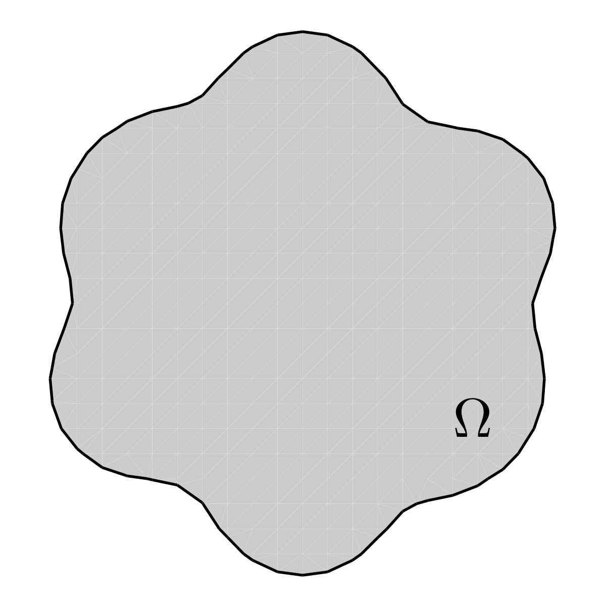 | 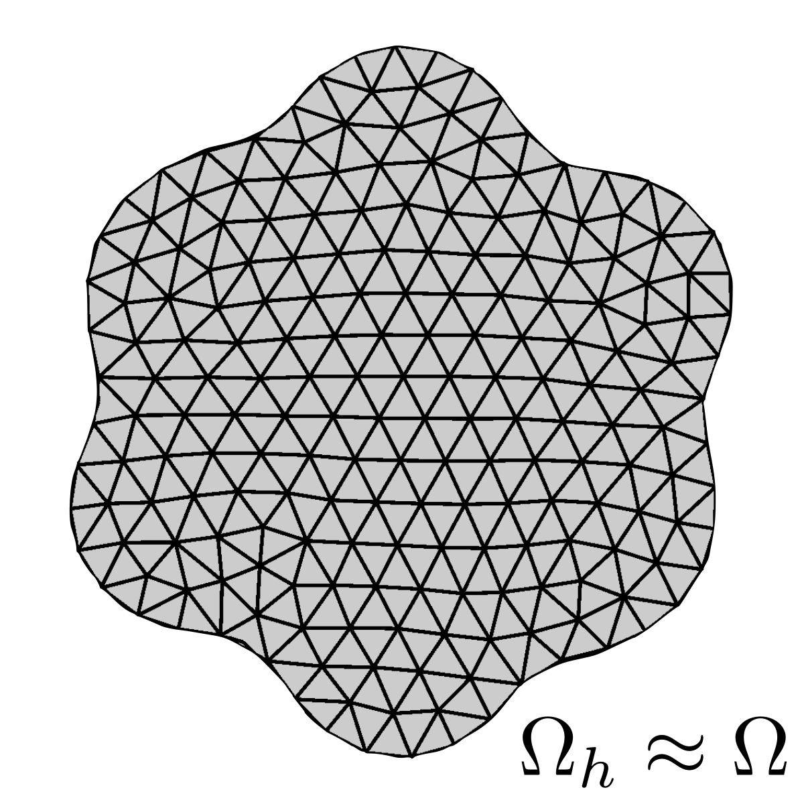 |
| $\mathcal{L}(u) = f \text{ in } \Omega$ | $A \boldsymbol{u} = \boldsymbol{f}$ |

---

### Mesh-based approximation of PDEs

| Continuous | Discrete |
| ----  | ---- |
|  | 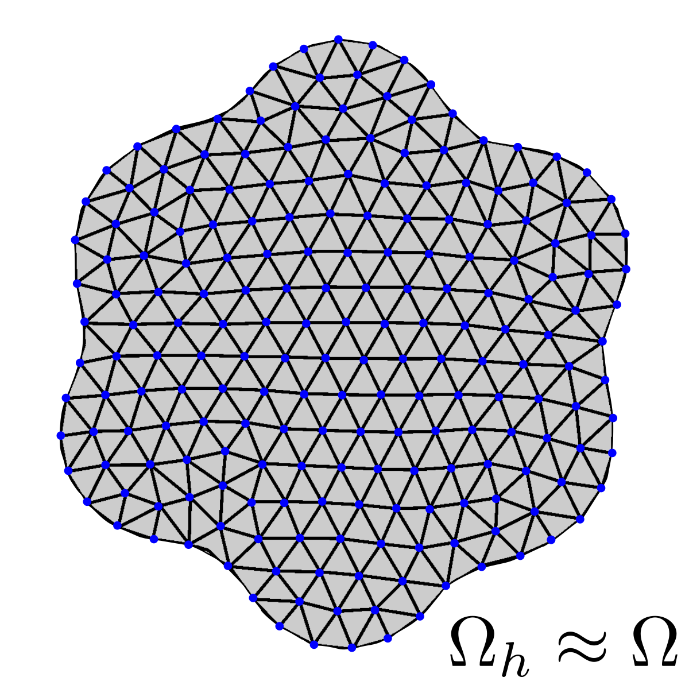 |
| $\mathcal{L}(u) = f \text{ in } \Omega$ | $A {\color{blue} \boldsymbol{u}} = \boldsymbol{f}$ |

---

### <!--- fit ---> Unfitted aka Embedded aka Immersed boundary aka etc

| Body-fitted | Unfitted |
| ----  | ---- |
|  | 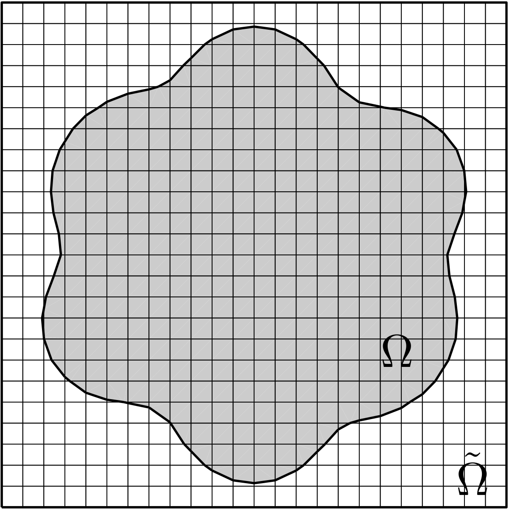

---

### Large-scale body-fitted meshing is very inefficient

##### Meshing bottleneck

In Hughes et al. CMAME 194 ('05) 4135–4195:

<small> _The typical situation in engineering practice is that designs are encapsulated in CAD systems and meshes are generated from CAD data._ [...] _It is estimated that **about 80% of overall analysis time is devoted to mesh generation** in the automotive, aerospace, and ship building industries. In the automotive industry, a mesh for an entire vehicle takes about four months to create._ </small>

---

### Large-scale body-fitted meshing is very inefficient

##### Partitioning bottleneck

| Body-fitted > _expensive_ | Cartesian grid > _trivial_ |
| ----  | ---- |
| 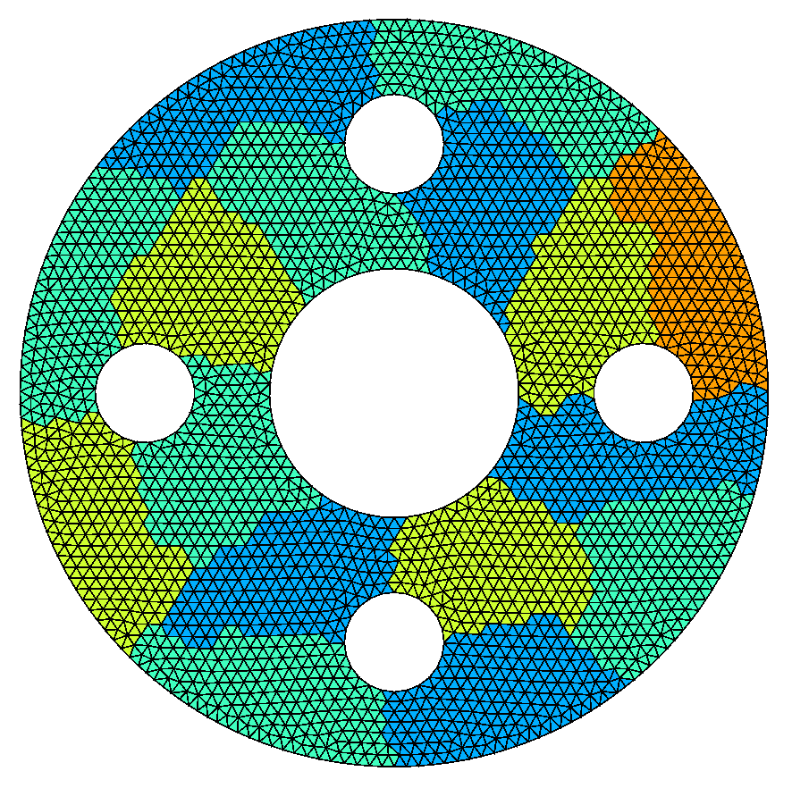 | 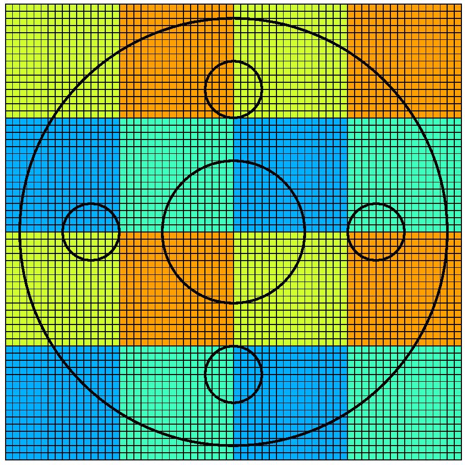

<!-- Maybe recall that mesh distributed among processors -->

---

### Large-scale body-fitted meshing is very inefficient

##### Adaptive mesh refinement bottleneck

Tree-based are currently the most scalable AMR approach:

<iframe width="420" height="236" src="https://www.youtube.com/embed/nF1B1hK5LCQ" title="YouTube video player" frameborder="0" allow="accelerometer; autoplay; clipboard-write; encrypted-media; gyroscope; picture-in-picture" allowfullscreen></iframe>

By Offermans et al.

---

### Unfitted FEM can overcome all these bottlenecks

##### [STLCutters.jl](https://github.com/gridap/STLCutters.jl) in [Badia, Martorell & Verdugo, '22](https://linkinghub.elsevier.com/retrieve/pii/S0021999122002248)


---

### Unfitted FEM can overcome all these bottlenecks

##### [STLCutters.jl](https://github.com/gridap/STLCutters.jl) in [Badia, Martorell & Verdugo, '22](https://linkinghub.elsevier.com/retrieve/pii/S0021999122002248)

```julia
julia> include("examples/LinearElasticity.jl")
julia> filename = "test/data/550964.stl"
julia> LinearElasticity.main(filename,n=50,force=(tand(5),0,-1),output="Eiffel")
```

```julia
julia> include("examples/Stokes.jl")
julia> filename = "test/data/47076.stl"
julia> Stokes.main(filename,n=10,output="ChichenItza")
```

Try other STLs from the [Thingi10K](https://ten-thousand-models.appspot.com/) dataset!

---

### Unfitted FEM can overcome all these bottlenecks

| Uniform grids | Adaptive grids |
| ----  | ---- |
| 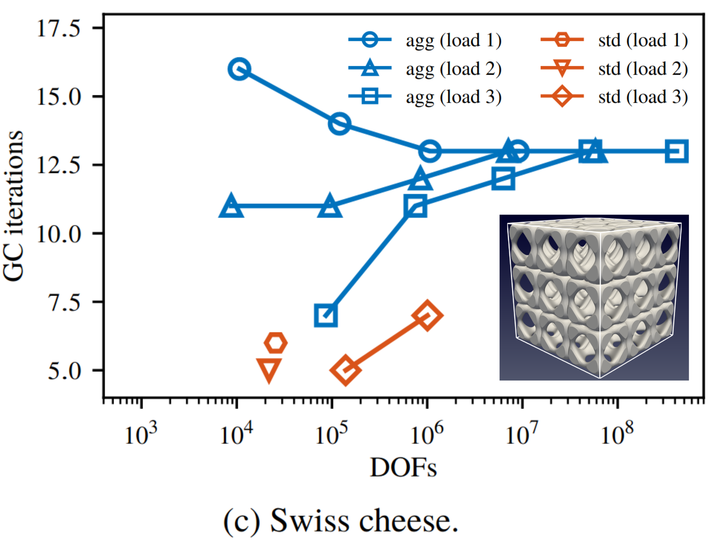 | 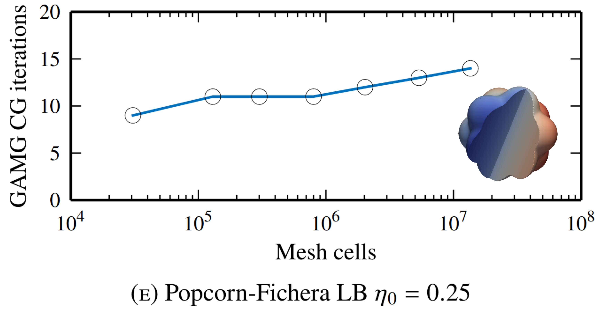 |
| <small>[Verdugo, Martín & Badia, '19](https://www.sciencedirect.com/science/article/abs/pii/S0045782519304542)</small> | <small>[Badia, N., Martín & Verdugo, '21](hhttps://epubs.siam.org/doi/10.1137/20M1344512)</small> |

---

### Outline

 - Motivation
 - The Finite Element Method
 - Unfitted FE approximations
 - Numerical examples

---

### <!--- fit ---> Poisson problem $\mathcal{L}(u) = - \Delta u$

##### <!--- fit ---> Differential equation or strong form

<!-- 
- Bypassing functional analysis and existence and uniqueness theorems
- The keys are that FEM approximates the variational problem and its relation to the minimisation problem
-->

$$
  \left\lbrace
  \begin{aligned}
    - \Delta u &= f \quad \ &\text{in} \ \Omega, \\
    u &= 0 \ &\text{on} \ \Gamma_{\rm D}, \\
    \nabla u \cdot \boldsymbol{n} &= g \ &\text{on} \ \Gamma_{\rm N}.
  \end{aligned}
  \right.
$$

$\footnotesize u \in \mathcal{C}^2(\overline{\Omega}), \ f \in \mathcal{C}(\Omega),$
$\footnotesize g \in \mathcal{C}(\partial \Omega \setminus \Gamma_{\rm D}) \ \text{and} \ \boldsymbol{n} \in [\mathcal{C}(\partial \Omega)]^d$

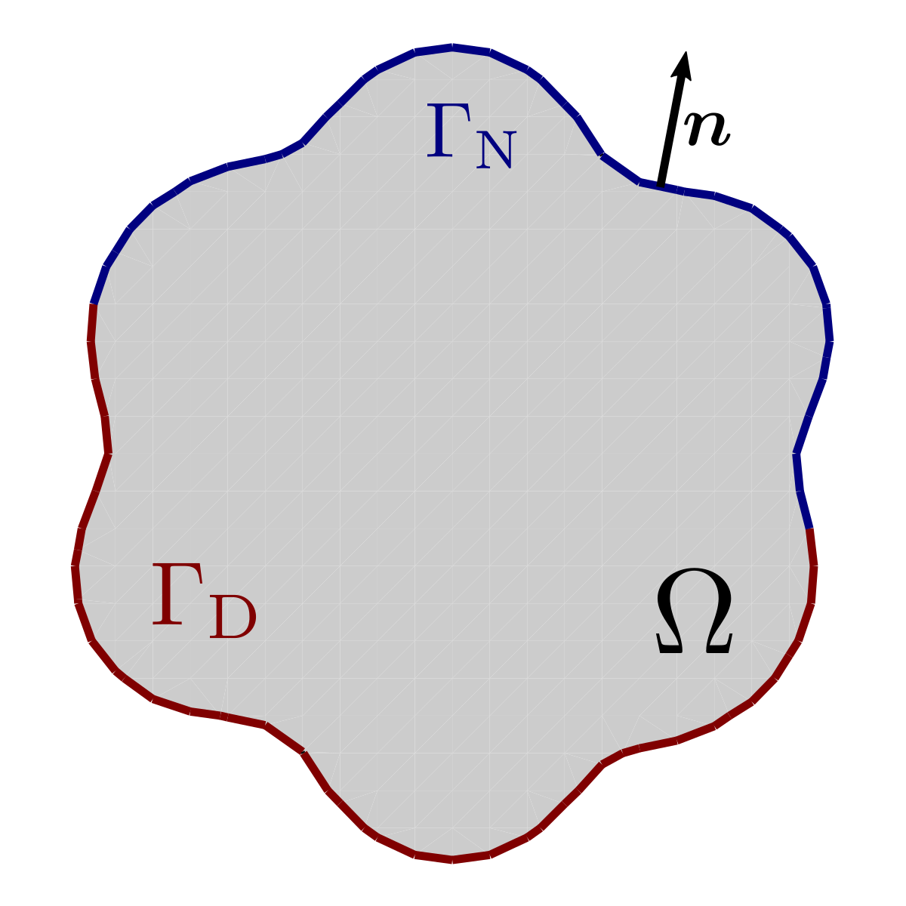

---

### <!--- fit ---> FEM approximates the variational or weak formulation

<!-- Go fast. Natural vs essential BCs -->

Let
$$
  \begin{aligned}
    H^1(\Omega) &\doteq \{v \in L_2(\Omega) : \nabla v \in L_2(\Omega)\}, \ \text{and} \\ 
    V &\doteq \{v \in H^1(\Omega) : v = 0 \ \text{on} \ \Gamma_D\} = H^1_{\Gamma_{\rm D}}(\Omega).
  \end{aligned}
$$

Multiply by $v \in V$, average over $\Omega$ and integrate by parts:

$$
  \begin{aligned}
    \int_{\Omega} f v \ \mathrm{d}\Omega = \int_\Omega (- \Delta u)v \ \mathrm{d}\Omega &= \int_\Omega \nabla u \cdot \nabla v \ \mathrm{d}\Omega \ - \int_{\Gamma_{\rm N}} ( \nabla u \cdot \boldsymbol{n} ) v \ \mathrm{d}\Omega = \\ &= \int_\Omega \nabla u \cdot \nabla v \ \mathrm{d}\Omega \ - \int_{\Gamma_{\rm N}} g v \ \mathrm{d}\Gamma, \quad \forall \ v \in V
  \end{aligned}
$$

---

### <!--- fit ---> FEM approximates the variational or weak formulation

<!-- Go fast. Natural vs essential BCs -->

Let
$$
  \begin{aligned}
    H^1(\Omega) &\doteq \{v \in L_2(\Omega) : \nabla v \in L_2(\Omega)\}, \ \text{and} \\ 
    V &\doteq \{v \in H^1(\Omega) : {\color{yellow}v = 0} \ \text{on} \ \Gamma_D\} = H^1_{\Gamma_{\rm D}}(\Omega).
  \end{aligned}
$$

Multiply by $v \in V$, average over $\Omega$ and integrate by parts:

$$
  \begin{aligned}
    \int_{\Omega} f v \ \mathrm{d}\Omega = \int_\Omega (- \Delta u)v \ \mathrm{d}\Omega &= \int_\Omega \nabla u \cdot \nabla v \ \mathrm{d}\Omega \ - \int_{\Gamma_{\rm N}} ( \nabla u \cdot \boldsymbol{n} ) v \ \mathrm{d}\Omega = \\ &= \int_\Omega \nabla u \cdot \nabla v \ \mathrm{d}\Omega \ - {\color{yellow}\int_{\Gamma_{\rm N}} g v \ \mathrm{d}\Gamma}, \quad \forall \ v \in V
  \end{aligned}
$$

---

### <!--- fit ---> FEM approximates the variational or weak formulation

##### Statement of the weak form

<!-- Comment on regularity -->

$$
  \text{Find} \ u \in V \ \text{such that} \ a(u,v) = l(v), \enskip \forall v \in V,
$$

where 
$$
  \begin{aligned}
    a(u,v) &\doteq \int_\Omega \nabla u \cdot \nabla v \ \mathrm{d}\Omega &\text{bilinear symmetric (continuous)}\\ 
    l(v) &\doteq \int_{\Omega} f v \ \mathrm{d}\Omega + \int_{\Gamma_{\rm N}} g v \ \mathrm{d}\Gamma &\text{linear (bounded)}
  \end{aligned}
$$

---

### <!--- fit ---> Variational problem is related to the minimisation problem

##### Total potential energy
$$
  J(v) \doteq \frac{1}{2} a(v,v) - \ell(v)
$$

##### Statement of the minimisation problem
$$
u \doteq \underset{v \in V}{\mathrm{argmin}} \ J(v)
$$

---

### <!--- fit ---> Variational problem is related to the minimisation problem

Perturbing around the global min. $u \in V$ with $v \in V$ and $\alpha \in \mathbb{R}$,
$$
\begin{align*}
  0 = \lim_{\alpha \to 0} \frac{J(u + \alpha v) - J(u)}{\alpha} &= \lim_{\alpha \to 0} \frac{\alpha a(u,v) + \frac{\alpha^2}{2} a(v,v) - \alpha \ell(v)}{\alpha} \\ &= a(u,v) - \ell(v), \quad \forall v \in V,
\end{align*}
$$
we recover the variational statement.

###### Remark

Equivalence between strong and weak in the sense of distributions

---

### Galerkin approximation

**Goal:** Map $\infty$-dim. variational problem to a discrete one.

Given
$$
u \in V : a(u,v) = l(v), \quad \forall v \in V,
$$
let us consider a finite dimensional vector subspace $V_N \subset V$, with $\mathrm{dim}(V_N) = N$. The Galerkin approximation of the problem reads
$$
u_N \in V_N : a(u_N,v_N) = l(v_N), \quad \forall v_N \in V_N.
$$

<!--
 - Recasting the problem into a discrete vector subspace 
 - If (V) is well-posed, then (G) is well-posed (previous theorem for finite dim, also) 
-->

---

### Galerkin approximation as a linear system

Since $V_N$ is a real vector space of dim $< \infty$, we can pick a basis $\mathcal{B} = \{ \varphi_1, \ldots, \varphi_N \}$ of $V_N$. Thus, the Galerkin problem is equivalent to:

Find $u_N = \sum_{i=1}^N u_i \varphi_i$ with $\boldsymbol{u} = (u_1,\ldots,u_n)^t \in \mathbb{R}^N$ such that
$$
  \begin{aligned}
    \mathbf{A}& \boldsymbol{u} = \mathbf{f}, \ \text{where} \\
    \mathbf{A}& \in \mathbb{R}^{N \times N}, \ A_{ij} \doteq a(b^j,b^i), \quad &i,j \in \{ 1, \ldots, N \}, \\
    \mathbf{f}& \in \mathbb{R}^{N}, \ f_i \doteq \ell(b^i), \quad &i \in \{ 1, \ldots, N \}.
  \end{aligned}
$$

---

### <!--- fit ---> The Finite Element Method

<!-- The two key ingredients are: -->
- **Mesh**
  - $\mathcal{T}_h$ is partition of $\Omega_h \approx \Omega$ into cells $K$
  - $h = \max_{K \in \mathcal{T}_h} {\rm diam}(K)$ (mesh size)
- **Basis** of $V_N$
  - Globally continuous functions
  - Polynomials inside $K$
$$
  V_h = \{ v_h \in \mathcal{C}(\Omega_h) : v_h |_K \in \mathcal{P}(K), \forall K \in \mathcal{T}_h \}
$$
 


---

### Lagrangian Finite Elements


---

### Numerical integration of the weak form

$$
  \footnotesize{}
  \begin{aligned}
    \text{E.g.} \ A_{ij} = a(\varphi_j,\varphi_i) &= \int_{\Omega_h} \nabla \varphi_j \cdot \nabla \varphi_i \ \mathrm{d}\Omega, \\
    &= \sum_{K \in \mathcal{T}_h} \int_K \nabla \varphi_j |_K \cdot \nabla \varphi_i |_K \ \mathrm{d}{\Omega_K}, \\
    &= \sum_{K \in \mathcal{T}_h} \left( \sum_{g \in Q} w_g \nabla \varphi_j |_K (x_g) \cdot \nabla \varphi_i |_K (x_g) \right) 
  \end{aligned}
$$


---

### Unfitted finite element methods

| Body-fitted | Unfitted |
| ----  | ---- |
|  | 

---

### Unfitted finite element methods

- Implicit geometry representation is _flexible_
  - A level-set function $\psi$ such that $\partial \Omega \equiv \{ \psi = 0 \}$
  - An STL file, scan data... the key is to tell inside from outside $\Omega$
- Challenges
  - Cut-cell integration
  - Imposing Dirichlet (essential) boundary conditions
  - Stability and conditioning w.r.t. small cut elements

- See [de Prenter, Verhoosel, van Brummelen, Larson & Badia, subm.](https://arxiv.org/abs/2208.08538)

---

### Cut-cell integration

- Now $\mathcal{T}_h$ triangulates $\tilde{\Omega}$ and $\Omega \subset \tilde{\Omega}$, so
$$
  \text{E.g.} \ A_{ij} = a(\varphi_j,\varphi_i) = \sum_{K \in \mathcal{T}_h} \int_{\color{yellow} \Omega \cap K} \nabla \varphi_j |_K \cdot \nabla \varphi_i |_K \ \mathrm{d}{\Omega_K}
$$

- Must modify local integration on cut cells
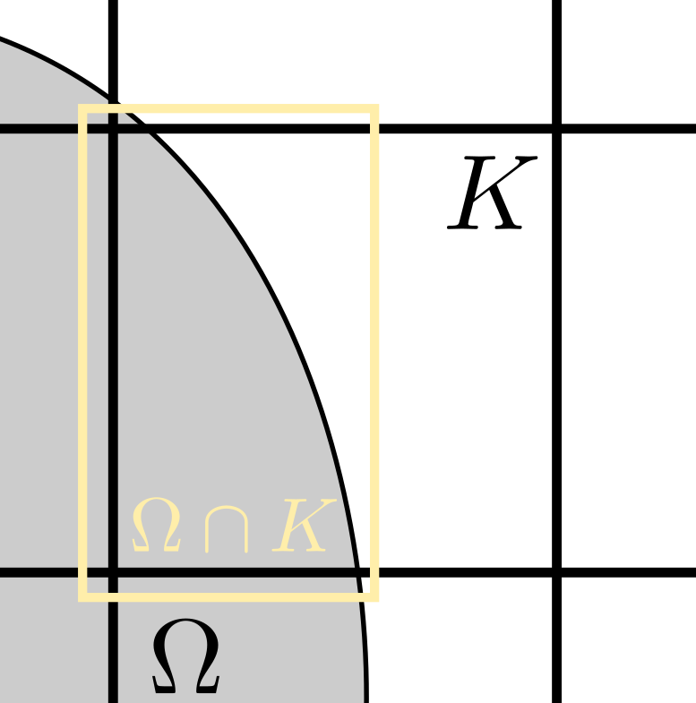

<!-- - We exchanged geometric complexity for integration complexity
- See [de Prenter, Verhoosel, van Brummelen, Larson & Badia, subm.](https://arxiv.org/abs/2208.08538) -->

---

### <!--- fit ---> Cut-cell integration uses implicit geometry representation

- See review in, e.g., [Saye, '22](https://www.sciencedirect.com/science/article/pii/S002199912100615X)
- Techniques w/different accuracy/robustness/cost balances, e.g.:

| Subtriangulation | Height functions |
| ----  | ---- |
| 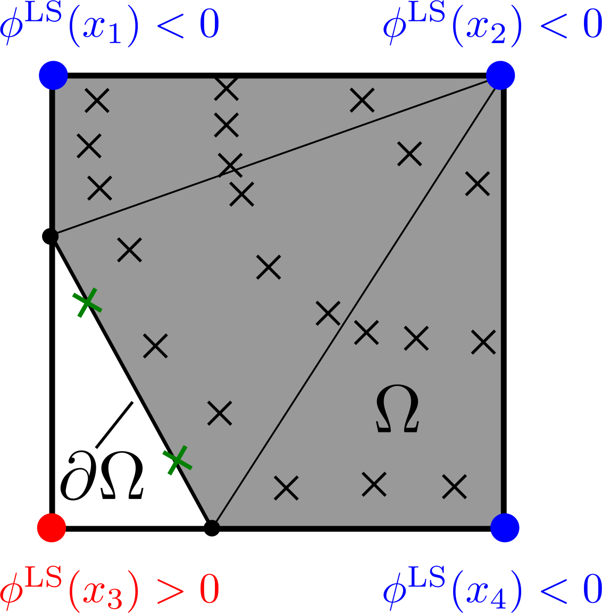 | 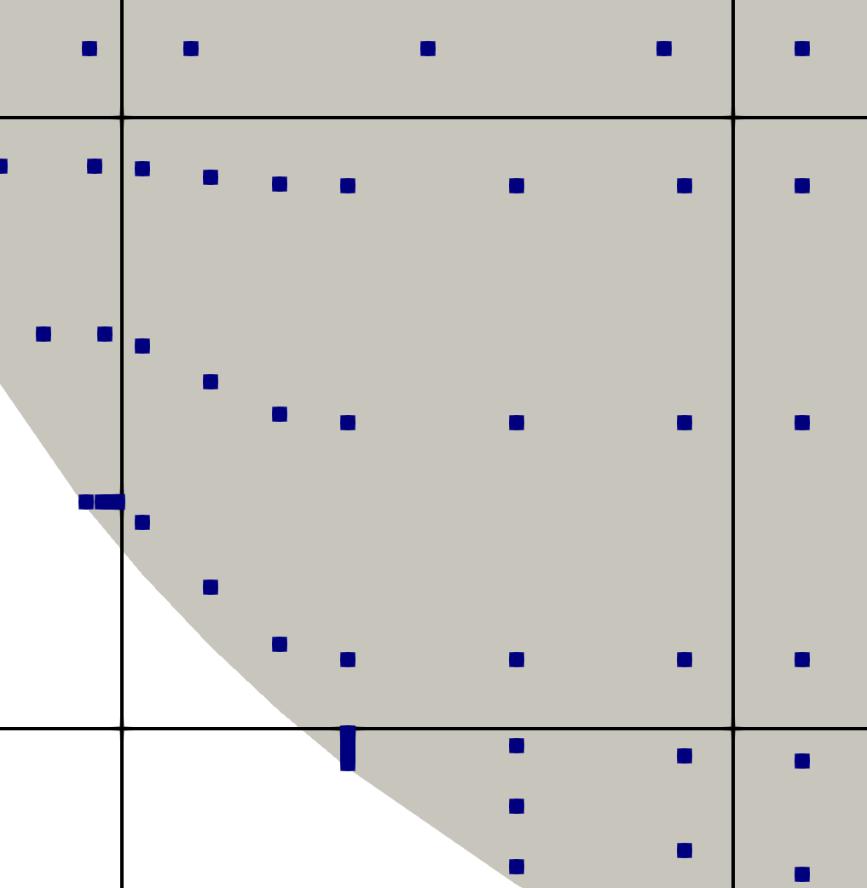 |

<!-- | [Burman et al., 2015](https://onlinelibrary.wiley.com/doi/full/10.1002/nme.4823) | [Saye, 2015](https://epubs.siam.org/doi/10.1137/140966290) and [2022](https://www.sciencedirect.com/science/article/pii/S002199912100615X) | -->

<!-- Recasting as the graph of a height function -->

---

### Imposing Dirichlet boundary conditions

| Model problem | Body-fitted | Unfitted |
| ---- | ---- | ---- |
| 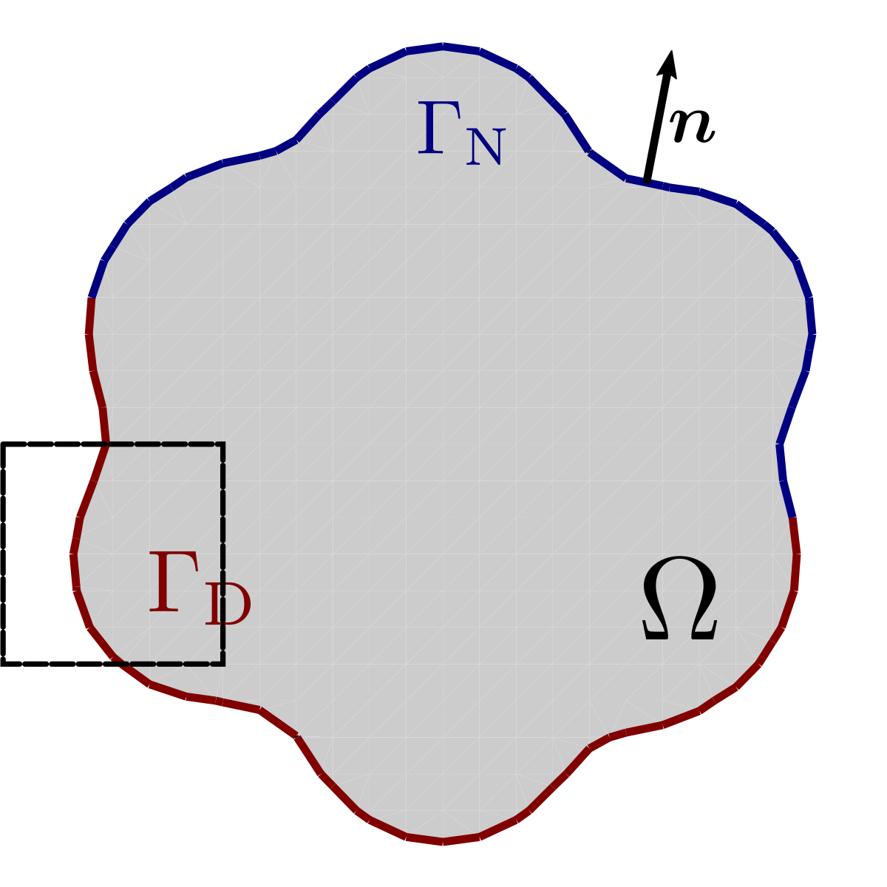 |  | 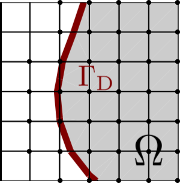 |
| Close-up | Remove Dirichlet DoFs | ??? |

---

### Imposing Dirichlet boundary conditions

- See review in, e.g., [Fernández-Méndez and Huerta, '04](https://www.sciencedirect.com/science/article/pii/S0045782504000222)
- Weak imposition of Dirichlet BCs with Nitsche's method

$$
  \begin{aligned}
    a_K(u,v) &\doteq \int_{\Omega \cap K} \nabla u \cdot \nabla v \ \mathrm{d}\Omega \color{yellow}+ \int_{\Gamma_{\rm D} \cap K} \beta_K uv -  (\nabla u \cdot \boldsymbol{n} ) v - (\nabla v \cdot \boldsymbol{n} ) u \ \mathrm{d}\Omega \\ 
    l_K(v) &\doteq \int_{\Omega \cap K} f v \ \mathrm{d}\Omega + \int_{\Gamma_{\rm N} \cap K} g v \ \mathrm{d}\Gamma \color{yellow}+ \int_{\Gamma_{\rm D} \cap K} \beta_K u_{\rm D}v - (\nabla v \cdot \boldsymbol{n} ) u_{\rm D} \ \mathrm{d}\Omega
  \end{aligned}
$$

- $\color{yellow}\beta_K$ must be large enough to ensure coercivity (uniqueness)
<small> (In our model problem $u_D = 0$) </small>

---

### Stability to small cut cells

- If nothing done in unfitted, $\beta_K$ can be arbitrarily large:

| Body-fitted | _Naive_ unfitted |
| ----  | ---- |
| 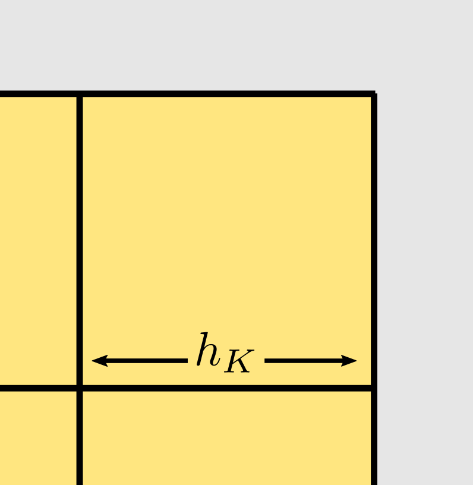 | 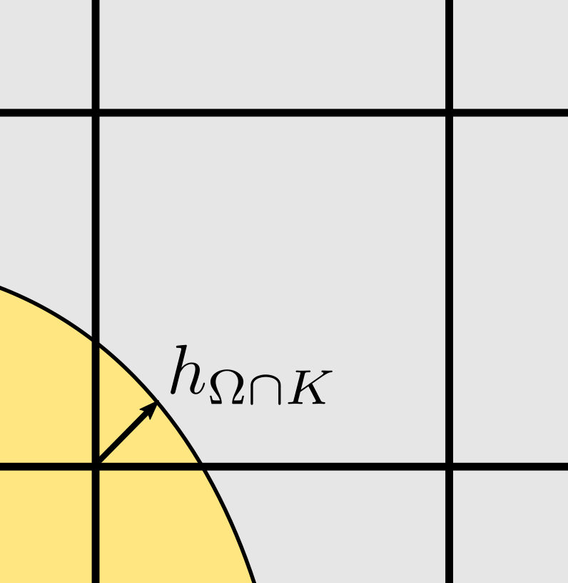 |
| $\beta_K \sim h_{K}^{-1}$ | $\beta_K \sim h_{\Omega \cap K}^{-1}$ |

---

### Ill-conditioning with small cut cells

- If nothing done in unfitted, $k_2(A)$ can be arbitrarily large:

| Body-fitted | _Naive_ unfitted |
| ----  | ---- |
| 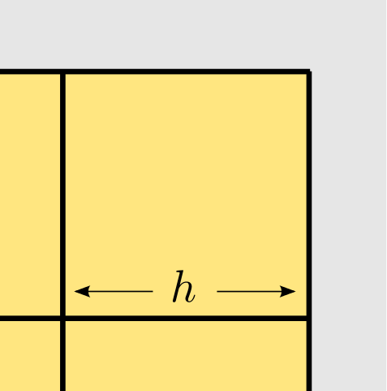 | 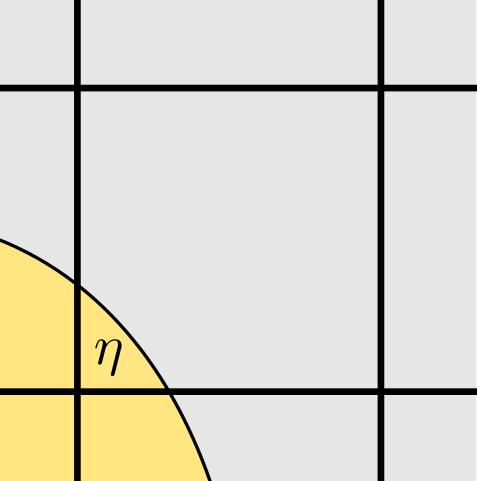 |
| $k_2(A) \sim h^{-2}$ | $k_2(A) \sim \eta^{-(2p+1-2/d)}$ |

---

##### Stable and well-conditioned unfitted FEMs

### Ghost penalty

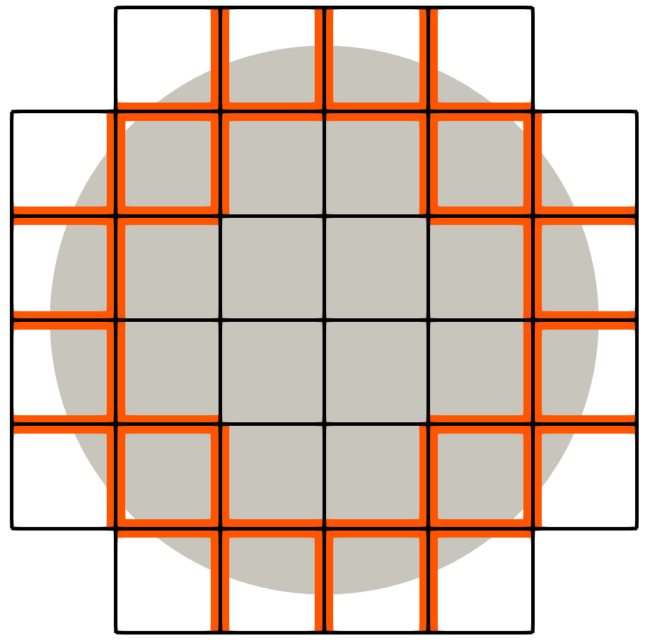

Add stabilising term. Linear case:

$$
  s(u,v) = \sum_{F \in {\color{orange}\mathcal{F_g}}} \int_{F} \gamma^s h \ \llbracket \boldsymbol{n}_F \cdot \nabla u \rrbracket \llbracket \boldsymbol{n}_F \cdot \nabla v \rrbracket 
$$

where ${\color{orange}\mathcal{F_g}}$ is the ghost skeleton.

Order > 1: add high-order derivatives.

---

##### Stable and well-conditioned unfitted FEMs

### Aggregated FEM (AgFEM)

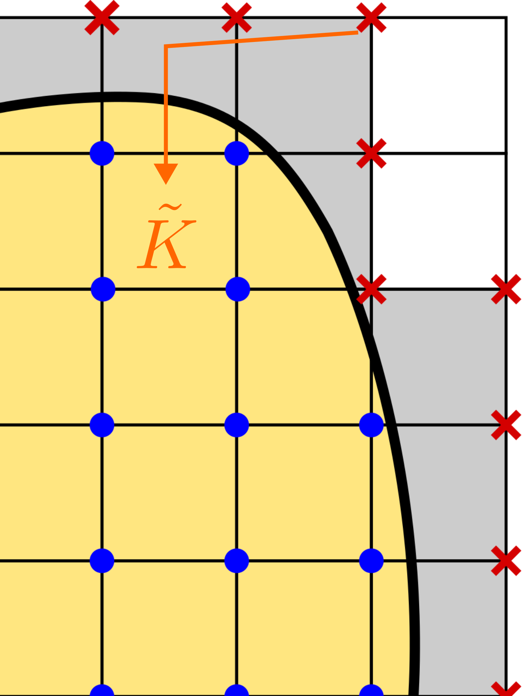

${\color{blue}\bullet}$ interior DOFs ($\mathcal{I}$) and ${\color{red}\boldsymbol{\times}}$ exterior DOFs ($\mathcal{E}$)

Extrapolate ${\color{red}\boldsymbol{\times}}$ DOFs from ${\color{blue}\bullet}$ DOFs:

$$
  u_{{\color{red}\boldsymbol{\times}}} = \sum_{{\color{blue}\bullet}\in \tilde{K}({\color{red}\boldsymbol{\times}})} \varphi_{{\color{blue}\bullet}}(x_{{\color{red}\boldsymbol{\times}}})u_{{\color{blue}\bullet}}, \quad \forall {\color{red}\boldsymbol{\times}} \in \mathcal{E}
$$

where $\tilde{K}({\color{red}\boldsymbol{\times}})$ is an interior cell of $\mathcal{T}_h$.

---

### Stable and well-conditioned unfitted FEMs

$\beta \sim h^{-1}$ and $k_2(A) \sim h^{-2}$ holds for both methods ✅

Refer to
 - [Badia, N. and Verdugo, CMAME 388 ('22), 114232](https://www.sciencedirect.com/science/article/pii/S0045782521005594)

for
- Mathematical analysis and numerical comparison
- Links between AgFEM and ghost penalty

---

### AgFEM examples: (Navier-)Stokes flows


[Badia, Verdugo and Martín, SISC 40(6) ('18), B1541-B1576](https://epubs.siam.org/doi/abs/10.1137/18M1185624)

---

### AgFEM examples: (Multi-)interface flows


[N. and Badia, CMAME 380 ('21), 113769](https://www.sciencedirect.com/science/article/pii/S0045782521001055)

---

### AgFEM examples: High-order approximations


[Badia, N. and Verdugo, Comput. Math. with Appl. 127 ('22), 105-126](https://www.sciencedirect.com/science/article/pii/S0898122122004138)

---

### Try unfitted FEM yourself at [GridapEmbedded.jl](https://github.com/gridap/GridapEmbedded.jl)

- A very expressive API to solve complex PDEs with few lines of code
- Write weak form with almost 1:1 to the mathematical notation

<div class="centered-video">
  <iframe width="560" height="315" src="https://www.youtube.com/embed/hsQiFP4S5RY?start=173" title="YouTube video player" frameborder="0" allow="accelerometer; autoplay; clipboard-write; encrypted-media; gyroscope; picture-in-picture" allowfullscreen></iframe>
</div>

---

<!-- 
_class: lead
_paginate: false
_header: ' '
_footer: ''
-->

# Thank you!!!


<small>
<br>
Special thanks to F. Verdugo and P.A. Martorell for providing some of their pictures for these slides.
</small>

---

<!-- 
_class: lead
_paginate: false
_header: ''
_footer: ''
-->


<div class="caption-text-erc">
This material is part of a project that has received funding from the European Research Council (ERC) under the European Union’s Horizon 2020 research and innovation programme (Grant agreement No. 949267).

Except where otherwise noted, this work and its contents (texts and illustrations) are licensed under the Attribution 4.0 International ([CC BY 4.0](https://creativecommons.org/licenses/by/4.0/)).
</div>